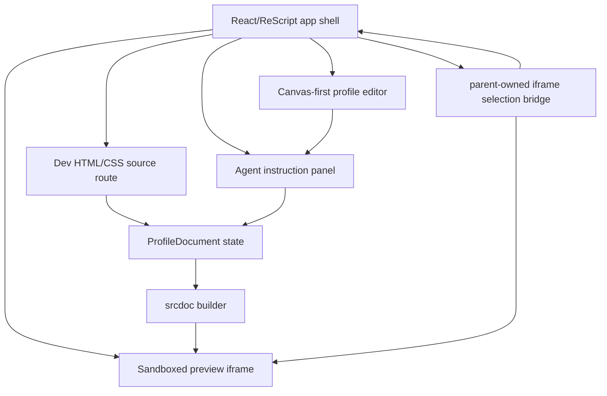

# Architecture

## Shape

Vibespace is a frontend-only app. The durable object is a profile document containing raw HTML and CSS. React/ReScript owns the app shell, and the iframe owns rendering the generated page.

## ReScript Boundaries

- `packages/generative-ui` is the first extracted generative-UI core package. It is written in ReScript and emits genType TypeScript surfaces for consumers that cannot call ReScript modules directly. The package currently owns the product-neutral prompt composer, raw document source wrappers, failed-patch shape, web-context sanitization, and trusted URL policy.
- `ProfileDocument.res` owns the typed document and revision updates.
- `ProfileSelection.res` owns clicked-element and dragged-area context.
- `ProfileFixture.res` owns the seeded fake profile HTML/CSS.
- `SelectionBridge.res` uses the experimental ReScript WebAPI package for iframe DOM selection.
- The GraphQL-side assistant service handles OpenAI interop. Browser JS adapters are limited to DOM and `html-to-image` screenshot capture.

This follows the local ReScript preference for typed domain modules and narrow interop. ReScript should not spread raw DOM/message parsing throughout the app. Domain state uses opaque string-backed modules for IDs, HTML/CSS source, timestamps, screenshots, selectors, and revisions; variants model route, selection kind, validation, and prompt draft status. Raw strings are acceptable at UI, storage, DOM, iframe, and Codex/OpenAI boundaries only after a local decoder has been identified. See `docs/TYPE_SYSTEM_REVIEW.md`.

## Rendering Boundary

The iframe no longer injects a selection script. The parent app attaches a typed selection bridge after the iframe loads and uses same-origin iframe access to read DOM metadata and capture real PNG crops of dragged areas with `html-to-image`. The generated profile document itself must not contain JavaScript. This is a local prototype tradeoff, not the expected production sandbox policy.

Before a generated profile document is rendered or applied from Codex, Vibespace runs a basic validation pass. Unsafe documents are left editable in the source route, but the preview renders a blocked-message document instead of executing the unsafe source.

## Agent Boundary

The app has two edit paths:

- Manual source editing.
- Agent-generated document replacement.

Both paths update `ProfileDocument`, so the raw HTML/CSS source remains the source of truth. The primary UX now defaults to edit mode and captures model input from the anchored canvas prompt: instruction text, selection type, visual bounds, viewport size, screenshot crop, and buffered DOM metadata for elements clearly inside the selected area. Area metadata uses a 20px edge buffer so elements barely touching the selection are excluded. Valid Codex JSON patches from the canvas prompt are applied immediately after validation.

Applied prompt history is stored in localStorage and, for new entries, includes the full HTML/CSS snapshot that was applied. The history sidebar can restore those snapshots after validation. Older history entries without snapshots intentionally show a restore error instead of running a migration.

Runtime assistant prompts are assembled with XML sections in `packages/generative-ui/src/DocumentEditPrompt.res` and called from the GraphQL-side `packages/schema/src/AgentEditService.js`. Searchable agent guidance lives under `docs/agent-context` and should stay short enough to use selectively.

`apps/web/src/WebCapabilities.res` remains Vibespace-specific because it parses and expands existing trusted placeholders inside the browser preview. New assistant generation now runs through the GraphQL mutation and backend-only `OPENAI_API_KEY`; the server rejects raw scripts, raw iframes, raw remote images, arbitrary remote URLs, forms, and newly invented trusted placeholder sources.

## Package Boundary

The extracted `@vibespace/generative-ui` package is not a renderer. It should stay focused on generative-code contracts:

- prompt construction and XML section ordering.
- typed raw HTML/CSS document and patch values.
- sanitized web context, capability policy text, and trusted URL allowlists.
- TypeScript interop generated by genType for non-ReScript consumers.

The Vibespace app still owns app-native UI, iframe rendering, screenshot capture, DOM selection metadata, localStorage prompt drafts, and browser-only placeholder expansion. Send Stores is React Native, so it should consume this package as a prompt/policy core and add a Send-specific renderer/translation layer rather than transplanting the iframe implementation directly.

Canvas prompt requests run through the Relay `submitAgentEdit` mutation and apply the persisted profile version returned by GraphQL. Normal canvas edits default to the fast model, while the source-route test lane can request deeper reasoning explicitly.

Generated and seeded profile blocks should carry `data-vibespace-name` and `data-vibespace-description` alongside stable `data-vibespace-id` anchors. Vibespace intentionally uses attributes instead of comments so the clicked element can be parsed directly. Prompt bubbles, saved drafts, history, and agent selection context use those friendly labels and descriptions; stored raw selector/tag/text snapshots are sanitized on load so non-developer users do not see markup language. Validation rejects anchored profile parts that omit the friendly name or description.

## Frontend Routes

The app shell now uses `rescript-relay-router` with route assets in `apps/web/src/routes`.
The root editor route preloads the viewer profile through `rescript-relay` and
falls back to `ProfileFixture.initialDocument` when the backend returns no
current version.

- `/` is the canvas-first editor.
- `/source` is the small developer route for raw HTML/CSS editing and the Codex dev lane.
- Future onboarding image upload and profile description input are stubbed in code but intentionally hidden from the main UI.

## ReScript-Shadcn Note

App-native UI should use ReScript-shadcn/shadcn primitives where practical. The generated profile document must remain raw HTML/CSS and should not depend on app shell UI libraries. See `docs/RESCRIPT_SHADCN_AUDIT.md` for the current gap analysis and rewrite targets.
