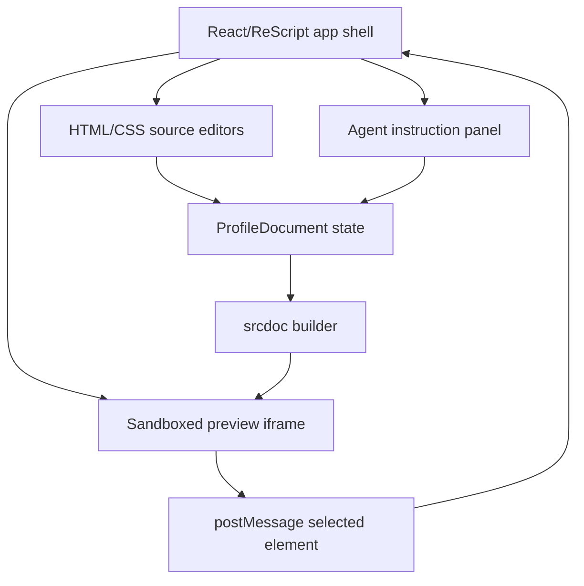

# Architecture

## Shape

Vibespace is a frontend-only app. The durable object is a profile document containing raw HTML and CSS. React/ReScript owns the app shell, and the iframe owns rendering the generated page.

## ReScript Boundaries

- `ProfileDocument.res` owns the typed document and revision updates.
- `Selection.res` owns clicked-element context.
- `ProfileFixture.res` owns the seeded fake profile HTML/CSS.
- JS adapters handle browser APIs and Tambo interop.

This follows the local ReScript preference for typed domain modules and narrow interop. ReScript should not spread raw DOM/message parsing throughout the app.

## Rendering Boundary

The iframe uses `sandbox="allow-scripts"` only so the injected preview click bridge can run. The generated profile document itself must not contain JavaScript. The MVP does not attempt production-grade sanitization, but the architecture isolates preview content from the React shell.

## Agent Boundary

The app has two edit paths:

- Manual source editing.
- Agent-generated document replacement.

Both paths update `ProfileDocument`, so the raw HTML/CSS source remains the source of truth.

## ReScript-Shadcn Note

There does not appear to be a stable dedicated `rescript-shadcn` package in the npm registry. For MVP, the shell uses shadcn-like primitives as plain CSS classes: panels, buttons, textareas, cards, and status pills. This keeps the prototype unblocked while preserving a future slot for generated shadcn-style controls if a maintained ReScript binding becomes available.

