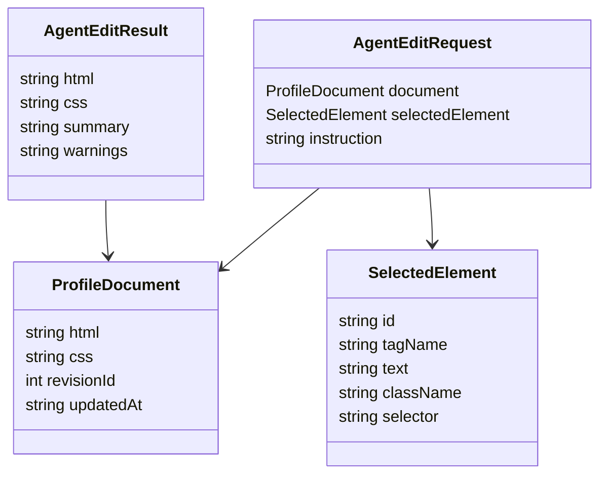
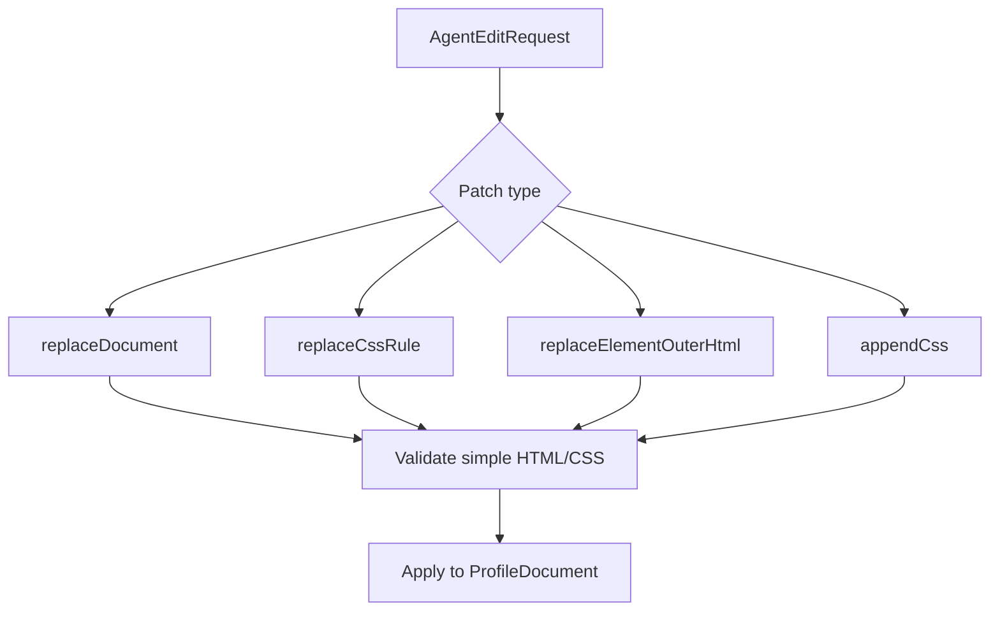

# Generative HTML/CSS Agent Model

## Goal

The agent is a profile layout collaborator. It receives the current profile document, optional selected element context, and a user instruction. It returns a new HTML/CSS document that preserves user content unless asked otherwise.

## Document Contract

## Prompt Rules

- Return simple HTML and CSS only.
- Never include `<script>`, inline event handlers, remote scripts, or generated JavaScript.
- Preserve meaningful content unless the user requests content changes.
- Prefer expressive visual changes over generic clean-card UI.
- Keep stable `data-vibespace-id` attributes where possible.
- If adding new major sections, include new `data-vibespace-id` values.

## Tambo MVP Integration

Tambo is registered with a `ProfileDocumentPatch` generative component. The component accepts:

- `html`: complete profile HTML replacement.
- `css`: complete profile CSS replacement.
- `summary`: short explanation.
- `warnings`: optional caveat.

Applying the component updates the raw document source and rerenders the iframe. The Tambo chat form sends the current HTML, CSS, selected element, and user instruction as one context-rich prompt. The local deterministic edit button remains available so the editor loop can be tested without `VITE_TAMBO_API_KEY`.

## Why Full Replacement First

Patch protocols create early ambiguity: CSS selectors can drift, HTML nodes can move, and partial edits require conflict resolution. Full replacement is blunt, but it makes the first data contract obvious. Once the UX proves itself, add a structured patch format.

## Future Patch Shape

