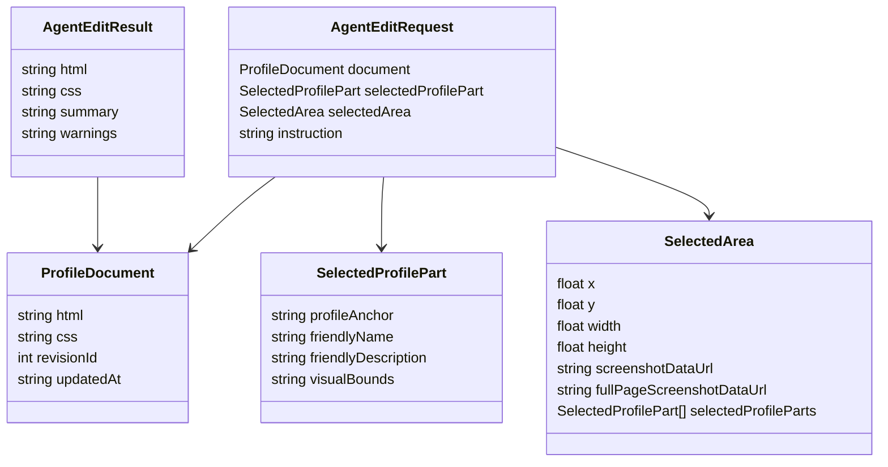
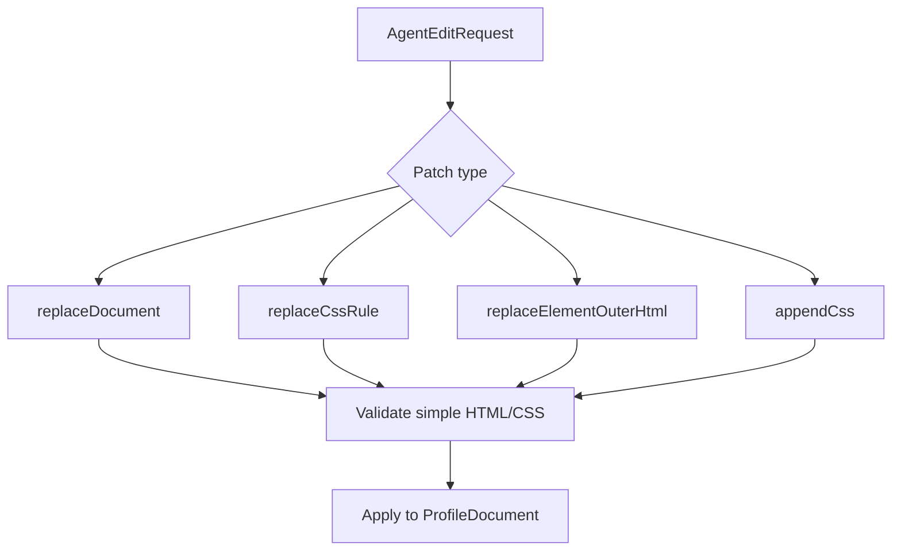

# Generative HTML/CSS Agent Model

## Goal

The agent is a profile layout collaborator. It receives the current profile document, optional friendly selection context, and a user instruction. It returns a new HTML/CSS document that preserves user content unless asked otherwise.

## Document Contract



## Prompt Rules

- Return simple HTML and CSS only.
- Never include `<script>`, `<style>`, inline `style` attributes, inline event handlers, remote scripts, or generated JavaScript.
- Put all visual styling in the returned `css` field. The returned `html` field is only structure, content, classes, and `data-vibespace-id` anchors.
- Preserve meaningful content unless the user requests content changes.
- Prefer expressive visual changes over generic clean-card UI.
- Keep stable `data-vibespace-id` attributes where possible.
- If adding new major sections, include new `data-vibespace-id` values.
- Add short `data-vibespace-name` and `data-vibespace-description` attributes to meaningful editable blocks so the app can show friendly selection names.
- Runtime selection context should use friendly names, descriptions, visual bounds, and profile anchors. Do not pass raw selected copy, selector strings, tag names, or class names as the primary agent context.
- Structure runtime edit prompts with XML sections so the agent can read task, user intent, screenshots, selection context, source, rules, and response contract in order.

## Searchable Context

Short prompt references live in `docs/agent-context`. Search them instead of injecting everything into each request:

```bash
rg "music" docs/agent-context
rg "## audio" docs/agent-context
rg "data-vibespace-id" docs/agent-context
rg "Browser Compatibility" docs/agent-context
```

## Codex MVP Integration

The canvas prompt bubble is the canonical MVP Codex/OpenAI path when backend-only `OPENAI_API_KEY` is configured. The source route keeps a dev-lane chat for debugging, but the primary test is: select a profile area, type in the anchored prompt, send it through the Relay `submitAgentEdit` mutation, validate/persist the returned HTML/CSS on the server, and immediately replace the live iframe document.

The model must return a JSON profile patch:

- `html`: complete profile HTML body fragment rooted at one `<main>` element.
- `css`: complete profile CSS replacement.
- `summary`: short explanation.
- `warnings`: optional caveat or an empty string.

Applying the JSON patch updates the raw document source and rerenders the iframe. The canvas prompt sends the current HTML, CSS, friendly selected-part or selected-area context, screenshots when available, capability planning output, web context, and user instruction as one context-rich XML-organized prompt.

The app now uses a small structured AI capability planner before web resolution. The planner reads the user request, selected context, and current profile source, then decides whether the edit needs reference context, trusted-frame resolution, trusted-image resolution, or no external capability. This replaces product-intent phrase parsing; the model should infer requests such as ambience, motion, images, media, favorite things, or vibe from the full message and current page. Deterministic checks remain only for hard safety blocking, trusted URL validation, and generated markup validation.

If the capability planner decides the user is asking for unsupported interactivity, such as a real game, app, tool, stateful control, or custom JavaScript runtime, it should return a user-facing warning before generation continues. The prompt bubble displays that warning, and generation should continue as an HTML/CSS-only Myspace-style decorative interpretation without claiming the result is fully playable.

The app does not derive creative scope with regex rules. Codex receives the current saved HTML/CSS and selection metadata, then infers whether the user wants the selected area, surrounding region, or whole profile changed. A clicked `profile-root` or profile background is weak placement context, not permission to redesign the whole profile. The canvas prompt path defaults to the fast model; the source test lane can choose deeper reasoning.

Additive requests should preserve by default. When the user asks to add, show, include, list, or create a new component, Codex should insert the requested component and keep the existing hero, root background, trusted images, copy, layout, classes, and global CSS stable unless the user explicitly asks for a restyle or redesign.

For named public figures, artists, places, media, brands, or eras, future server-side context resolution should first disambiguate the entity and return design-useful facts. Tribute pages must not imply official endorsement, quote lyrics, or invent biographical claims.

Codex must not write raw iframes, scripts, remote images, direct audio/video URLs, or arbitrary links. Existing trusted-frame placeholders may be preserved from the current document, but the server currently rejects newly invented trusted-frame and trusted-image sources.

For reference or vibe-driven styling, Codex should use web facts to make the requested change visually specific. Additive requests should apply that specificity to the new component and nearby supporting details while preserving the existing page design; explicit broad redesign requests can translate references into layout, typography, trusted images, texture, badges, stickers, frames, section names, and copy tone across the page. If `web_context.safeImages` contains relevant images, Codex should use at least one prominently unless the selected area is too small. GIF or moving-background requests should prefer verified animated trusted images when available; otherwise Codex should use trusted static imagery plus CSS motion and warn that no animated trusted image was available. Trusted image URLs are extracted and verified by Vibespace from source-page HTML before generation; they are not model-invented upload paths. Vibespace still renders a branded fallback inside the same placeholder if a remote image later fails to load. Codex must not load arbitrary remote images or links; trusted images must use `data-vibespace-capability="trusted_image"` with the exact URL from `web_context.safeImages.imageUrl`.

When a selected area is a broken trusted image fallback and the user asks to retry or fix it, the model should focus on replacing that one image placeholder with a better candidate from the current web context. It should avoid broad page redesign unless the user explicitly asks for it.

The canvas-first input path now captures a richer request shape before generation: prompt text, selection kind, element context when clicked, dragged-area bounds, viewport size, buffered DOM metadata for up to 60 elements inside the selected area, and a PNG crop when available. Drag-area metadata excludes elements that only touch the outer 20px selection edge so accidental edge hits do not pollute agent context. The next screenshot step is to include a full-page before screenshot from the same selection request, so the agent receives both the whole page context and the selected-region crop.

Prompt drafts are saved in local storage while the user types, can be minimized, and can be reopened from the sidebar. The current implementation supports one active prompt bubble at a time; multiple simultaneous prompt bubbles are planned next.

Generated patches are validated before they can replace `ProfileDocument`. Codex output must be a body fragment, not a full HTML document; `<!doctype>`, `<html>`, `<head>`, and `<body>` wrappers are rejected. The server applies Vibespace policy checks for scripts, style tags, inline style attributes, inline event handlers, executable URLs, raw embeds, forms, CSS imports, generic remote resource loads, raw remote images, and newly invented trusted capability placeholders.

`AgentEditService.js` validates the generated patch before persisting a new profile version. If validation fails, the edit session is marked failed and the draft remains open with the returned validation message.

If a model wants to apply one-off visual styling, it must create a class and place the declaration in CSS:

- Bad: `<div style="color:red">Favorite song</div>`
- Good: `<div class="favorite-song-card" data-vibespace-id="favorite-song">Favorite song</div>` plus `.favorite-song-card { color: red; }`

## Why Full Replacement First

Patch protocols create early ambiguity: CSS selectors can drift, HTML nodes can move, and partial edits require conflict resolution. Full replacement is blunt, but it makes the first data contract obvious. Once the UX proves itself, add a structured patch format.

## Future Patch Shape


