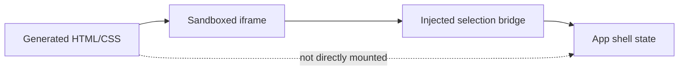

# HTML/CSS Rendering Boundary

## MVP Policy

Generated profile content is raw HTML and CSS. It is rendered in an iframe, not injected into the app shell DOM.

Allowed:

- HTML elements.
- CSS rules.
- `data-vibespace-id` attributes.
- Static text and layout markup.

Disallowed:

- `<script>`.
- Inline event handlers such as `onclick`.
- Remote script tags.
- Browser storage access from generated content.
- Runtime JavaScript as part of the generated profile.

## Why Iframe First

The iframe lets the prototype keep high customization while reducing blast radius. The app shell can crash less often when generated markup is bad, and future production work can layer sanitization or policy checks onto the same boundary.

## Known MVP Gaps

- CSS can still create unusable layouts.
- CSS can reference remote URLs.
- The iframe click bridge is injected by the app, so `allow-scripts` is required.
- No persistence or rollback UI exists beyond manual source edits.

## Next Safety Layer

Add a validation pass before applying agent output:

- Remove scripts and inline event handlers.
- Reject `javascript:` URLs.
- Optionally warn on remote images/fonts.
- Preserve required `data-vibespace-id` anchors where possible.

