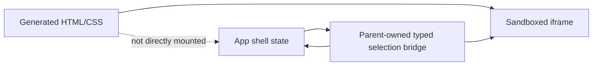

# HTML/CSS Rendering Boundary

## MVP Policy

Generated profile content is raw HTML and CSS. It is rendered in an iframe, not injected into the app shell DOM.

Allowed:

- HTML elements.
- CSS rules.
- `data-vibespace-id` attributes.
- Static text and layout markup.
- Validated inert trusted-frame capability placeholders such as `data-vibespace-capability="trusted_frame"`.
- Validated inert trusted-image capability placeholders such as `data-vibespace-capability="trusted_image"`.

Disallowed:

- `<script>`.
- `<style>` tags inside generated HTML.
- Inline `style` attributes.
- Inline event handlers such as `onclick`.
- Remote script tags.
- Browser storage access from generated content.
- Runtime JavaScript as part of the generated profile.
- Raw embedded documents, forms, CSS imports, arbitrary image URLs, and arbitrary remote resource loads in this local MVP.

## Why Iframe First

The iframe lets the prototype keep high customization while reducing blast radius. The app shell can crash less often when generated markup is bad, and future production work can layer sanitization or policy checks onto the same boundary.

The canvas MVP currently uses same-origin iframe access so the parent shell can attach the typed selection bridge and capture real PNG crops of dragged areas for future AI input. The iframe also allows a Vibespace-owned nonce script so nested trusted frames can work after Vibespace expands a validated capability placeholder and trusted images can mark themselves loaded or broken. Generated profile HTML is still validated to reject scripts and event handlers. This is acceptable for local prototyping, but production should revisit the sandbox, CSP, and screenshot pipeline before accepting arbitrary public documents. The next screenshot payload should capture both a full-page before image and the selected-region crop from the same iframe render.

## Known MVP Gaps

- CSS can still create unusable layouts.
- CSS remote URLs are rejected, but trusted-origin iframes and trusted-origin images can load through validated web capability placeholders.
- The MVP uses direct image-origin CSP allowlisting for trusted images; broken candidates render through a branded fallback, but a future proxy/cache should avoid third-party view beacons and improve reliability.
- Generated profile HTML must be a fragment rooted at one `<main>` element. Full-document wrappers such as `<!doctype>`, `<html>`, `<head>`, and `<body>` are rejected before preview/apply.
- Profile CSS is raw browser CSS. Validation now uses `lightningcss-wasm` for parser/compiler diagnostics, then applies Vibespace-specific policy checks for fragile or unsafe constructs.
- The parent-owned selection bridge still requires same-origin iframe access.
- Area screenshot capture currently requires same-origin iframe access.
- Full-page before screenshots are planned as paired context with the selected crop.
- No persistence or rollback UI exists beyond manual source edits.

## Next Safety Layer

Add a validation pass before applying agent output:

- [x] Use parser/compiler-backed validation instead of broad regex checks for generated HTML/CSS.
- [x] Reject scripts, style tags, inline style attributes, inline event handlers, executable URLs, CSS imports, embeds, forms, and remote resource loads before preview/apply.
- [x] Validate web capability placeholders before expanding them into trusted-origin frames and images.
- [x] Run validation inside the Codex adapter and make one repair-only model follow-up before surfacing invalid generated source.
- [ ] Preserve required `data-vibespace-id` anchors where possible.
- [ ] Add a richer warning model for safe-but-risky CSS and future uploaded assets.
