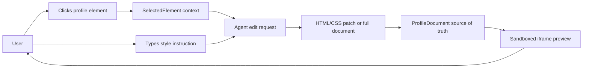

# Myspace Profile Customization Research

## North Star

Vibespace is not trying to clone every Myspace feature. It is trying to clone the feeling that made Myspace profile pages culturally powerful: a personal page could look nothing like anyone else's page, and the user could treat HTML/CSS as self-expression.

The bottleneck in the original era was authorship. A user needed to find layouts, copy snippets, understand enough HTML/CSS to avoid breaking the page, and tolerate inconsistent rendering. The Vibespace assumption is that agents remove that authorship bottleneck while preserving the core creative freedom.

## Relevant Myspace Traits

- Profiles were personal websites masquerading as social profiles.
- Users customized backgrounds, typography, colors, layout blocks, cursors, embedded media, and decorative effects.
- Profile markup often mixed structured profile data with raw creative markup.
- The page could be loud, messy, animated, and deeply personal.
- Social features mattered, but customization made the page feel owned.

## What We Keep For MVP

- A single profile document made from plain HTML and CSS.
- Raw markup remains inspectable and editable.
- Profile sections are addressable by stable ids so an agent can modify selected areas.
- Visual freedom beats component consistency inside the profile canvas.

## What We Explicitly Defer

- Friend graphs.
- Comments.
- Multi-profile routing.
- Persistence.
- Music players or embeds.
- Marketplace/store data.
- Production-grade moderation or sanitization.

## Product Thesis

If the user can click a profile section and say "make this look like a neon arcade flyer," the system should produce markup that feels like they wrote a custom profile layout by hand. The editor should make HTML/CSS feel approachable without hiding it.

## MVP Flow

## Assumptions To Revisit

- Full-document replacement may be simpler than patching for early agent experiments.
- Stable `data-vibespace-id` attributes are enough for point-and-click context.
- Plain CSS is expressive enough for the first prototype; no generated JavaScript is allowed.
- The UI shell should stay restrained so the generated profile owns the personality.

